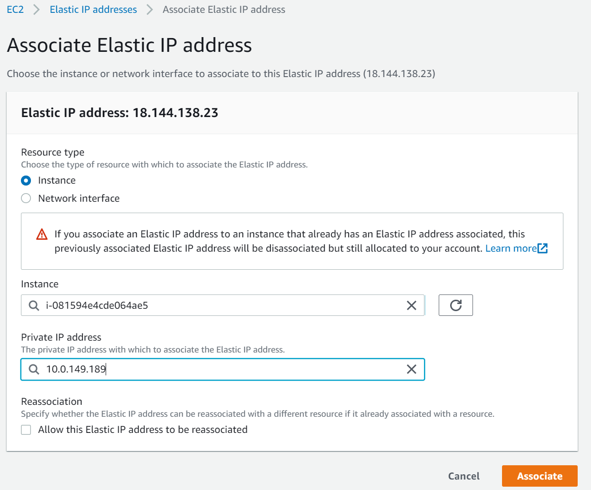
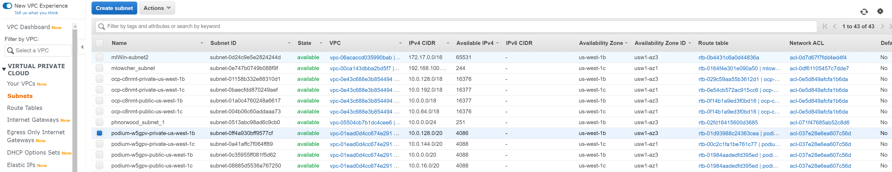
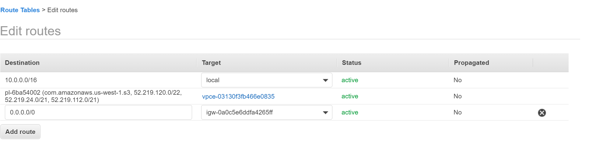

# AWS Configuration
OpenShift has two deployment possibilities on AWS: IPI (Installer Provisioned Infrastructure) or UPI (User Provisioned Infrastructure).

The video bridge used for video conferencing in Podium uses a node port and UDP. Clients connect directly from web browser or app. As such the video bridge requires an Elastic IP (EIP). It uses STUN to discover the EIP (since the EIP is not visible to the node) and broadcast that EIP to clients that connect for video/audio streaming.

By default IPI does not configure EIP and the worker nodes are not available from public internet. The recommendation is to setup a new machineset that will deploy public nodes on a different subnet. The subnet should be configured to use internet gateway not NAT gateway. Using the NAT gateway means the address discovered by STUN will be that of the NAT gateway and not the EIP of the worker node. Another option is to simply configure the existing nodes to use EIPs and Internet Gateway instead of NAT Gateway, below are the steps to that.

## Configure Existing nodes to use EIPs
To update existing nodes to use EIPs you simply need to allocate and associate an EIP and then update the node route table to use the internet gateway instead of NAT gateway. You will have to configure EIP for every node on the subnet else you will have communications issues in OpenShift.

### Associate EIP to worker node

### Update Subnet Route Table

