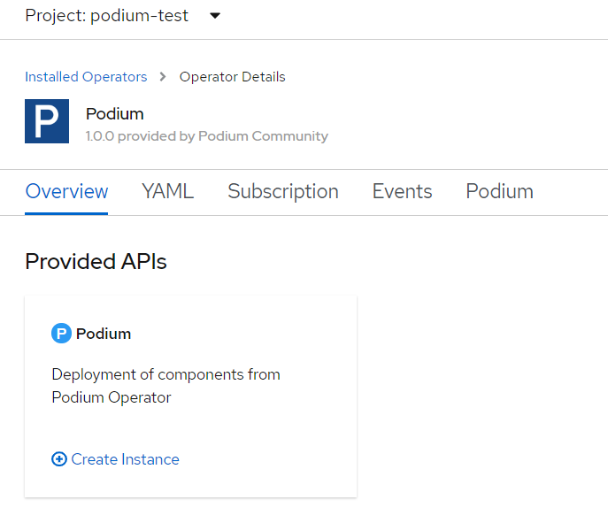
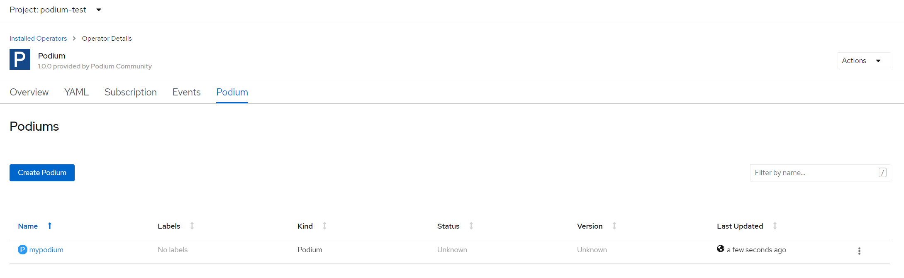

# Podium Operator
The podium operator will mange the deployment of podium environments accross the k8s cluster.

## Pre-requisites
* Public or rotable IP on at least one node.
* Port 30000 or whatever the jvb node port is on UDP needs to be open to public or routable IP.
* Port 3478 TCP/UDP needs to be open to public or routable IP.
* TLS certificate solution like Let's Encrypt.

## Label node where you want the Jitsi Video Bridge to run
The video bridge is required for video conferencing. Video and audio from clients are sent to the jitsi video bridge (jvb) via a UDP connection. The node running the jvb must have an internet or routable IP than can be reached from participants. Currently this is done by exposing a node port. The jvb service uses a STUN server to discover the routable IP so this is all dynamic. The deployment sets a nodeSelector so that the jvb pod will only run on nodes with a routable IP. You can label multiple nodes as well, as long as they have a routable IP.

```$ oc label node ocp4-n4krq-worker-v996z app=jvb```

## Install Podium Operator Using OLM
The Operator lifecycle manager comes built-in with OpenShift. It enables lifecyle management of an operator. In order to use OLM you need to package your operator and create a catalog that contains your operator bundle. To use the podium operator through OLM simply create a catalog source, pointing to the podium operator index bundle. Make sure it is created in the openshift-marketplace namespace or the namespace that is running OLM.

### Create Catalog Source for Podium Operator

```
$ vi catalogsource.yaml
apiVersion: operators.coreos.com/v1alpha1
kind: CatalogSource
metadata:
  name: podium-operator-catalog
spec:
  sourceType: grpc
  image: quay.io/ktenzer/podium-operator-index:latest
  displayName: Podium Operator Catalog
  publisher: Podium Community
```

```$ oc create -f catalogsource.yaml -n openshift-marketplace```

## Install Podium Operator via OperatorHub
Under OperatorHub search for podium and install operator.


## Select the Podium Operator
Create a new project and under installed operators you should see Podium Operator.


## Create a new podium instance
The Podium Operator will deploy an instance of Podium in your project. Create a new instance.


After creating instance you will see the Podium object and Podium will be deployed in your project.


After complete under routes click the dashboard (Moziak) to get started using Podium.

## Install Podium Operator Manually
The Podium Operator supports the scope of cluster or namespace. Simply change the path to CRD and yaml files to cluster (cluster scope) or namespace (namespace scope). 

When running in scope namespace, the operator and instance of podium will run in same project. The cluster namespace allows using a single podium operator and can deploy/manage podium instances accross the cluster.

### Create Namespace
This is only required for running operator in a cluster scope. If running in namespace scope just create
the project as you would for running the podium instance below.

```$ oc new-project podium-operator```

### Create Podium CRD
Choose cluster or namespace directory under deploy depending on scope.

```$ oc create -f podium-operator/deploy/cluster/crds/podium.com_podia_crd.yaml```

### Create Podium Service Account
Choose cluster or namespace directory under deploy depending on scope.

```$ oc create -f podium-operator/deploy/cluster/service_account.yaml```

### Create Podium Cluster Role
Choose cluster or namespace directory under deploy depending on scope.

```$ oc create -f podium-operator/deploy/cluster/role.yaml```

### Create Podium Operator Cluster Role Binding
Choose cluster or namespace directory under deploy depending on scope.

```$ oc create -f podium-operator/deploy/cluster/role_binding.yaml```

### Deploy Podium Operator
Choose cluster or namespace directory under deploy depending on scope.

```$ oc create -f podium-operator/deploy/cluster/operator.yaml```

# Deploy Instance of Podium using Operator

## Create New Project for Podium Instance
If running operator as scope namespace you already created this project so this step can be skipped.

```$ oc new-project podium```

### Instantiate Podium Instance using Operator

```
$ vi podium.yaml
apiVersion: podium.com/v1alpha1
kind: Podium
metadata:
  name: mypodium
spec:
  application_domain: <apps wildcard domain>
  namespace: <namespace>
  jvb_node_port: 30000
  lets_encrypt: true
  password_salt: password123
  admin_password_salt: admin123
  etherpad:
    enable: true
    application_name: etherpad
    default_title: "Welcome to Etherpad"
    default_text: "Etherpad is a real-time text editor"
  jitsi:
    enable: true
    application_name: jitsi
    jicofo_component_secret: s3cr3t
    jicofo_auth_user: focus
    jvb_auth_user: jvb
    jvb_brewery_muc: jvbbrewery
    jvb_tcp_harvester_disabled: 'true'
    jvb_enable_apis: rest
    jvb_stun_servers: meet-jit-si-turnrelay.jitsi.net:443
    timezone: Europe/Berlin
    jvb_node_selector: jvb
  mattermost:
    enable: true
    application_name: mattermost-team-edition
  wekan:
    enable: true
    application_name: wekan
    mongo_database_name: wekan
    mongo_database_user: wekan
  drawio:
    enable: true
    application_name: drawio
  dokuwiki:
    enable: true
    application_name: dokuwiki
  mozaik:
    enable: true
    application_name: mozaik
```

```$ oc create -f podium.yaml```

### Delete Podium Operator

```
$ oc delete project podium-operator
$ oc delete crd/podia.podium.com
$ oc delete clusterrole/podium-operator
$ oc delete clusterrolebinding/podium-operator
```
