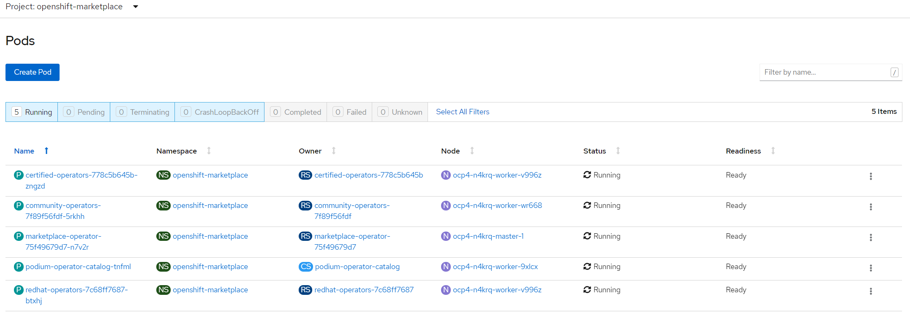
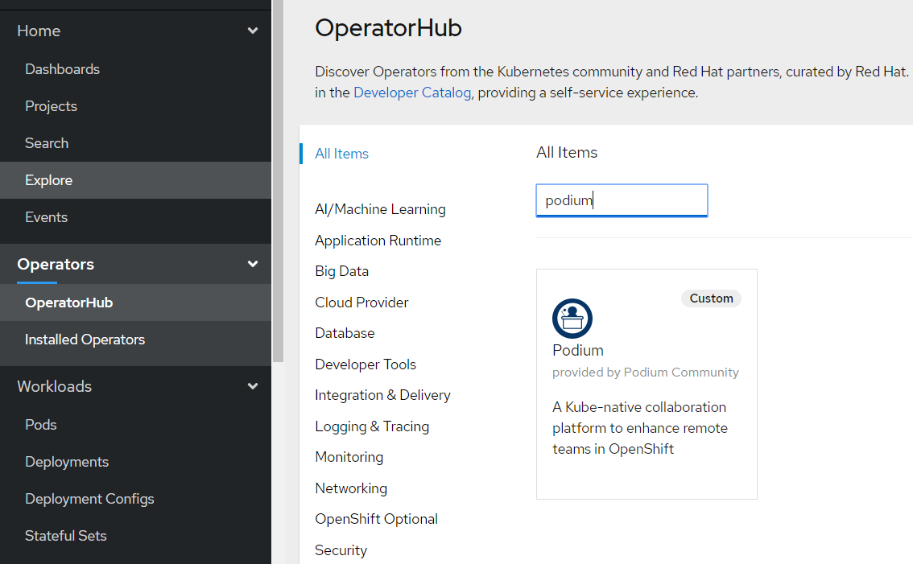
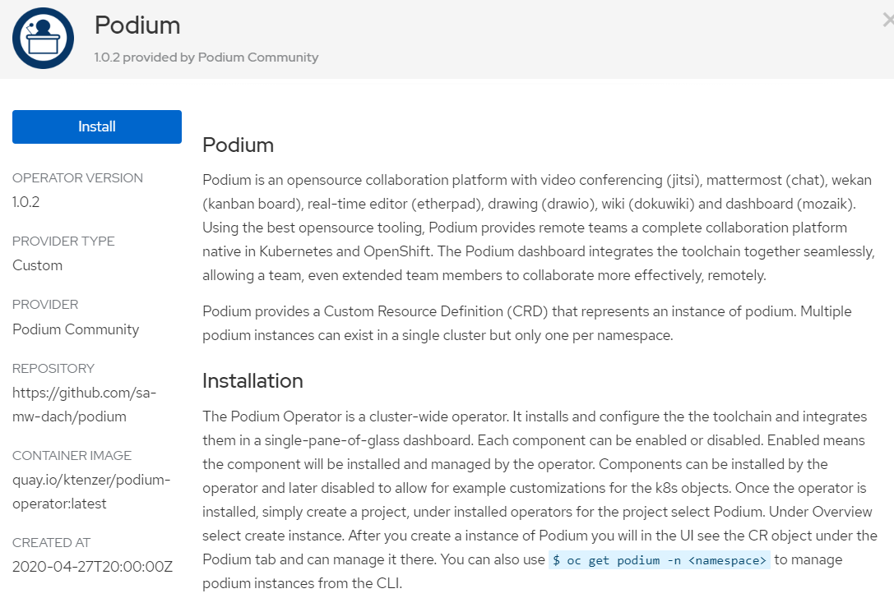
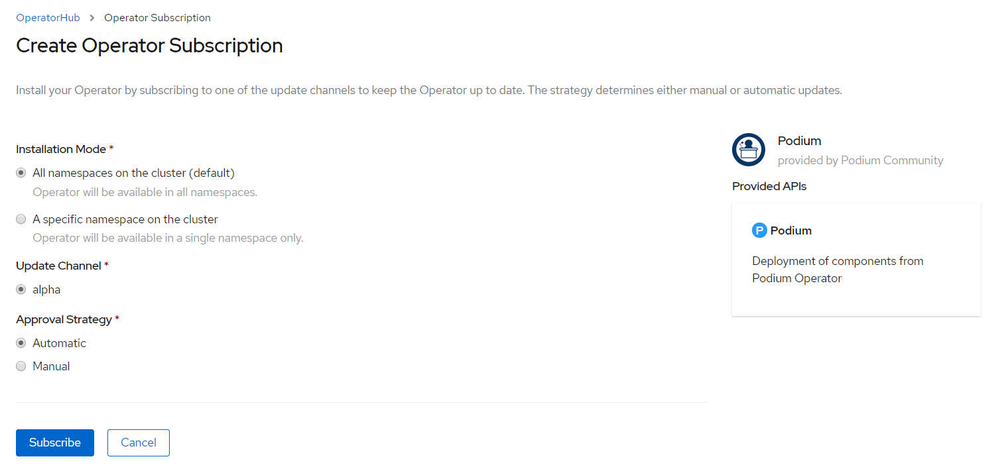
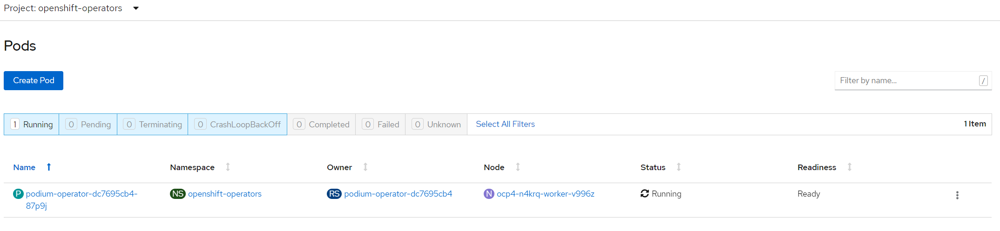
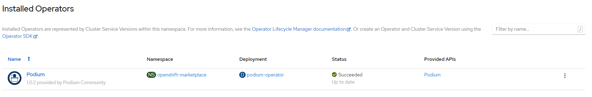
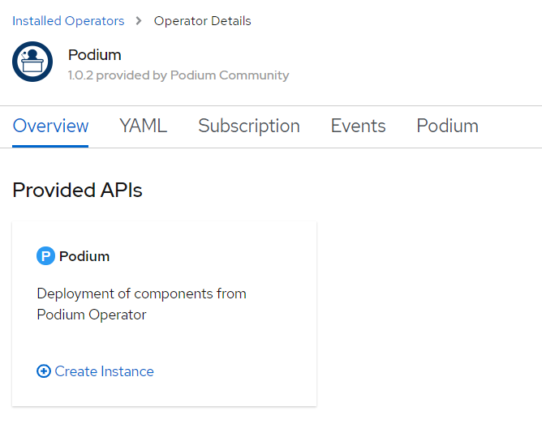
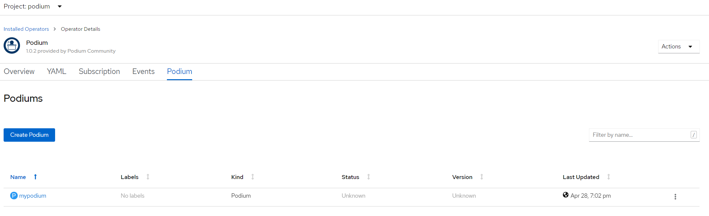

# Podium Operator
The podium operator will mange the deployment of podium environments accross the k8s cluster.

## Pre-requisites
* OpenShift environment
* Public or routable IP exists on node running the jvb (jitsi video bridge) pod.
* Port 30000 TCP/UDP ingress must be open on the node running the jvb pod.
* Port 3478 TCP/UDP egress must be open for from jvb node to STUN server.
* Ports 5347 TCP, 5222 TCP and 5280 TCP ingress must be open on all nodes running jitsi pods jvb, jicofo, prosody and web.
* TLS certificate solution like Let's Encrypt.

## Label node where you want the Jitsi Video Bridge to run
The video bridge is required for video conferencing. Video and audio from clients are sent to the jitsi video bridge (jvb) via a UDP connection. The node running the jvb must have an internet or routable IP than can be reached from participants. Currently this is done by exposing a node port. The jvb service uses a STUN server to discover the routable IP so this is all dynamic. The deployment sets a nodeSelector so that the jvb pod will only run on nodes with a routable IP. You can label multiple nodes as well, as long as they have a routable IP.

```$ oc label node ocp4-n4krq-worker-v996z app=jvb```

## Install Podium Operator Using OLM (Operator Lifecycle Manager)
The podium-operator is available in OpenShift OperatorHub as a community operator. However you may want to use the latest version, if so you can follow these steps.
The Operator lifecycle manager comes built-in with OpenShift. It enables lifecyle management of an operator. In order to use OLM you need to package your operator and create a catalog that contains your operator bundle. To use the podium operator through OLM simply create a catalog source, pointing to the podium operator index bundle. Make sure it is created in the openshift-marketplace namespace or the namespace that is running OLM.

### Create Catalog Source for Podium Operator

```
$ vi catalogsource.yaml
apiVersion: operators.coreos.com/v1alpha1
kind: CatalogSource
metadata:
  name: podium-operator-catalog
spec:
  sourceType: grpc
  image: quay.io/podium/podium-operator-index:1.0.5
  displayName: Podium Operator Catalog
  publisher: Podium Community
```

```$ oc create -f catalogsource.yaml -n openshift-marketplace```

The Podium catalog pod will be deployed in the openshift-marketplace namespace.


### Install Podium Operator via OperatorHub
Under OperatorHub search for podium and install operator.






The Podium operator will be installed as a pod in the openshift-operators namespace.


### Create new project
Under the project, installed operators, the Podium Operator should be visible. Select the Podium operator.


### Create a new podium instance
Select create new instance. Ensure at least one node is labeled with the jvb node selector. The Podium Operator will deploy an instance of Podium in your project. After complete under routes click the dashboard (Moziak) to get started using Podium.


The Podium instance can be managed under the Podium tab.


If you would like to manually change any of the components after deployment, set 'enable: false' in the Podium CR so that the operator ignores it.

## Install Podium Operator Manually
The Podium Operator supports the scope of cluster or namespace. Simply change the path to CRD and yaml files to cluster (cluster scope) or namespace (namespace scope). 

When running in scope namespace, the operator and instance of podium will run in same project. The cluster namespace allows using a single podium operator and can deploy/manage podium instances accross the cluster.

### Create Namespace
This is only required for running operator in a cluster scope. If running in namespace scope just create
the project as you would for running the podium instance below.

```$ oc new-project podium-operator```

### Create Podium CRD
Choose cluster or namespace directory under deploy depending on scope.

```$ oc create -f podium-operator/deploy/cluster/crds/podium.com_podia_crd.yaml```

### Create Podium Service Account
Choose cluster or namespace directory under deploy depending on scope.

```$ oc create -f podium-operator/deploy/cluster/service_account.yaml```

### Create Podium Cluster Role
Choose cluster or namespace directory under deploy depending on scope.

```$ oc create -f podium-operator/deploy/cluster/role.yaml```

### Create Podium Operator Cluster Role Binding
Choose cluster or namespace directory under deploy depending on scope.

```$ oc create -f podium-operator/deploy/cluster/role_binding.yaml```

### Deploy Podium Operator
Choose cluster or namespace directory under deploy depending on scope.

```$ oc create -f podium-operator/deploy/cluster/operator.yaml```

### Deploy Instance of Podium

### Create New Project for Podium Instance
If running operator as scope namespace you already created this project so this step can be skipped.

```$ oc new-project podium```

### Instantiate Podium Instance using Operator

```
$ vi podium.yaml
apiVersion: podium.com/v1alpha1
kind: Podium
metadata:
  name: mypodium
spec:
  jvb_node_port: 30000
  lets_encrypt: true
  password_salt: password123
  admin_password_salt: admin123
  etherpad:
    enable: true
    application_name: etherpad
    default_title: "Welcome to Etherpad"
    default_text: "Etherpad is a real-time text editor"
  jitsi:
    enable: true
    application_name: jitsi
    jicofo_component_secret: s3cr3t
    jicofo_auth_user: focus
    jvb_auth_user: jvb
    jvb_brewery_muc: jvbbrewery
    jvb_tcp_harvester_disabled: 'true'
    jvb_enable_apis: rest
    jvb_stun_servers: meet-jit-si-turnrelay.jitsi.net:443
    timezone: Europe/Berlin
    jvb_node_selector: jvb
  mattermost:
    enable: true
    application_name: mattermost-team-edition
  wekan:
    enable: true
    application_name: wekan
    mongo_database_name: wekan
    mongo_database_user: wekan
  drawio:
    enable: true
    application_name: drawio
  dokuwiki:
    enable: true
    application_name: dokuwiki
    repo_url: https://github.com/sa-mw-dach/podium.git
    default_acl: 8
    enable_git_push_integer: 1
    admin_password_hash: $2y$10$Az2nsAQKqNHWj09YV33v8.VWEmmXRKFm5AxfFWOAGGO4JDIsglIm.
  etherdraw:
    enable: true
    application_name: etherdraw
  mindmaps:
    enable: true
    application_name: mindmaps
  mozaik:
    enable: true
    application_name: mozaik
```

```$ oc create -f podium.yaml -n <namespace>```

#### Customize Podium Dashboard
The podium dashboard is fully customizable. Each widget can be replaced with your own tools. You need to provide the URL to your tool, a name and sometimes a image URL.

An example for adding bluejeans and google chat would be as follows:

```
  mozaik:
    enable: true
    application_name: mozaik
    custom_meeting_1_name: Bluejeans
    custom_meeting_1_url: https://redhat.bluejeans.com/5841755887
    custom_meeting_1_image_url: https://www.pennmedicine.org/-/media/images/logos/bluejeans%20logo.ashx?la=en
    custom_chat_name: GoogleChat
    custom_chat_url: https://chat.google.com/u/1/room/AAAAAf9HfUc
    custom_chat_image_url: https://1000logos.net/wp-content/uploads/2020/05/Google-Hangouts-Logo-640x360.png
```

An entire list of all the parameters can be found below:

```
  mozaik:
    enable: true
    application_name: mozaik
    custom_meeting_1_name:
    custom_meeting_1_url:
    custom_meeting_1_image_url:
    custom_meeting_2_name:
    custom_meeting_2_url:
    custom_meeting_2_image_url:
    custom_meeting_3_name:
    custom_meeting_3_url:
    custom_meeting_3_image_url:
    custom_wiki_name:
    custom_wiki_url:
    custom_wiki_image_url:
    custom_etherpad_1_name:
    custom_etherpad_1_url:
    custom_etherpad_2_name:
    custom_etherpad_2_url:
    custom_etherpad_3_name:
    custom_etherpad_3_url:
    custom_etherdraw_1_name:
    custom_etherdraw_1_url:
    custom_etherdraw_2_name:
    custom_etherdraw_2_url:
    custom_etherdraw_3_name:
    custom_etherdraw_3_url:
    custom_draw_name:
    custom_draw_url:
    custom_draw_image_url:
    custom_kanban_name:
    custom_kanban_url:
    custom_kanban_image_url:
    custom_mindmaps_name:
    custom_mindmaps_url:
    custom_mindmaps_image_url:
    custom_chat_name:
    custom_chat_url:
    custom_chat_image_url:
```

### Delete Podium Operator

```
$ oc delete project podium-operator
$ oc delete crd/podia.podium.com
$ oc delete clusterrole/podium-operator
$ oc delete clusterrolebinding/podium-operator
```
